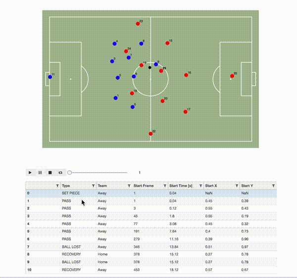

# Interactive Football Pitch Using Jupyter Widgets
Jupyter widgets allow to add interactivity to Jupyter notebooks. This repository contains an example notebook which uses `qgrid` and `bqplot` to create a simple interactive football pitch.
You can test it live in Binder or run it locally.  



## Run in Binder
If you do not want to clone the repository, you can just launch a notebook online using Binder.
[](https://mybinder.org/v2/gh/seidlr/fotd-interactive-football-pitch/master?filepath=Interactive-Football-Pitch.ipynb)


## Local installation
Make sure you have Anaconda installed. If not, you can follow the tutorial here: [Setting Up to do Data Science](https://www.youtube.com/watch?v=FZ_XTfezCH4)  
1. Clone or download this repository:
```
git clone https://github.com/seidlr/fotd-interactive-football-pitch.git
```
Then, change into the new directory
```
cd fotd-interactive-football-pitch
```
To run the example notebook, first create a `conda` environment.
```bash
conda env update
```
This creates an environment `fotd-interactive-football-pitch` which can be used in a jupyter notebook.
Next, activate the environment and start the notebook.
```bash
conda activate fotd-interactive-football-pitch
```
```bash
jupyter notebook Interactive-Football-Pitch.ipynb
```


